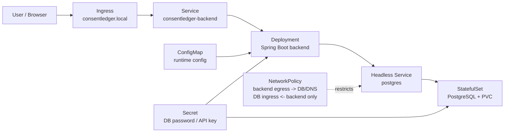

# ConsentLedger Kubernetes Security Deployment

Docker Compose 기반 배포 구조를 Kubernetes 환경으로 전환하며, Deployment, Service, ConfigMap, Secret, StatefulSet을 구성했습니다.

## Architecture



## What I implemented

- Migrated Docker Compose deployment to Kubernetes
- Configured Deployment, Service, ConfigMap, Secret, StatefulSet
- Restricted backend-db traffic with NetworkPolicy
- Applied non-root SecurityContext and resource limits
- Scanned container image with Trivy
- Reviewed cluster hardening items with kube-bench

## Directory structure

```text
ConsentLedger-k8s/
├── k8s/
│   ├── namespace.yaml
│   ├── backend-deployment.yaml
│   ├── backend-service.yaml
│   ├── postgres-statefulset.yaml
│   ├── postgres-service.yaml
│   ├── secret.yaml
│   ├── configmap.yaml
│   ├── ingress.yaml
│   ├── networkpolicy.yaml
│   └── rbac.yaml
├── security/
│   ├── trivy-report.md
│   ├── kube-bench-report.md
│   └── hardening-checklist.md
└── README.md
```

## Local Kubernetes deployment

### 1. Build the Docker image

```bash
docker build -t consentledger-backend:latest .
```

For kind, load the local image into the cluster:

```bash
kind load docker-image consentledger-backend:latest
```

### 2. Create a local cluster

Using kind:

```bash
kind create cluster --name consentledger
```

Using minikube:

```bash
minikube start
```

### 3. Install an ingress controller

For kind with ingress-nginx:

```bash
kubectl apply -f https://raw.githubusercontent.com/kubernetes/ingress-nginx/main/deploy/static/provider/kind/deploy.yaml
kubectl wait --namespace ingress-nginx --for=condition=ready pod --selector=app.kubernetes.io/component=controller --timeout=180s
```

For minikube:

```bash
minikube addons enable ingress
```

### 4. Update secrets

`k8s/secret.yaml` contains sample values only. Replace the database password and API key before deployment.

```bash
kubectl apply -f k8s/namespace.yaml
kubectl apply -f k8s/secret.yaml
```

### 5. Deploy ConsentLedger

```bash
kubectl apply -f k8s/
kubectl -n consentledger get pods,svc,ingress
```

If local DNS is not configured, add this host entry:

```text
127.0.0.1 consentledger.local
```

Then open:

```text
http://consentledger.local
```

For quick local testing without Ingress:

```bash
kubectl -n consentledger port-forward svc/consentledger-backend 8080:80
```

Then open:

```text
http://localhost:8080
```

## Security validation

### Trivy image scan

```bash
trivy image --severity HIGH,CRITICAL --format table consentledger-backend:latest
```

Save the result in `security/trivy-report.md`.

### kube-bench cluster scan

```bash
kube-bench run
```

Or run kube-bench inside the cluster:

```bash
kubectl apply -f https://raw.githubusercontent.com/aquasecurity/kube-bench/main/job.yaml
kubectl logs job/kube-bench
```

Save the result in `security/kube-bench-report.md`.

### Troubleshooting evidence

Use these commands to record deployment issues and operational evidence:

```bash
kubectl -n consentledger describe deployment consentledger-backend
kubectl -n consentledger logs deploy/consentledger-backend
kubectl -n consentledger get events --sort-by=.metadata.creationTimestamp
kubectl -n consentledger describe statefulset postgres
```

## Interview answer

실무 운영 경험은 아직 제한적이지만, 기존 ConsentLedger 프로젝트를 Kubernetes 환경으로 확장하며 기본 리소스와 보안 설정을 직접 구성해 봤습니다. Deployment, Service, Secret, ConfigMap, StatefulSet을 구성했고, NetworkPolicy로 백엔드와 DB 간 통신 범위를 제한했습니다. 또한 Trivy로 이미지 취약점을 점검하고, kube-bench 기준으로 클러스터 보안 항목을 확인하며 컨테이너 환경에서 보안 설정이 어떻게 운영 안정성과 연결되는지 학습했습니다.
