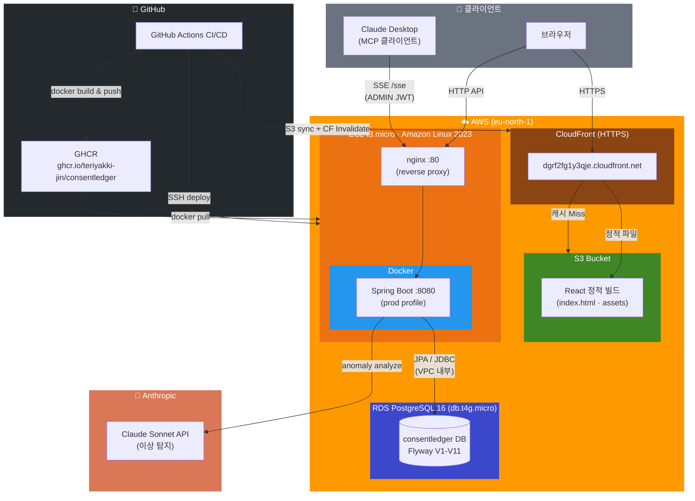
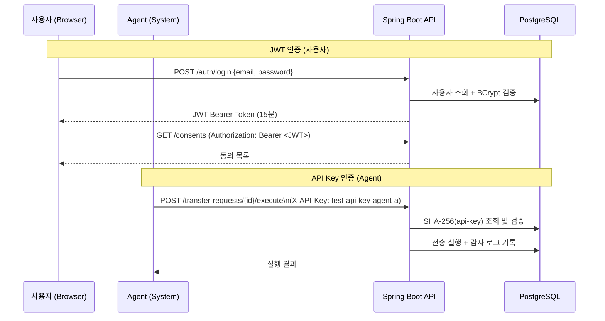
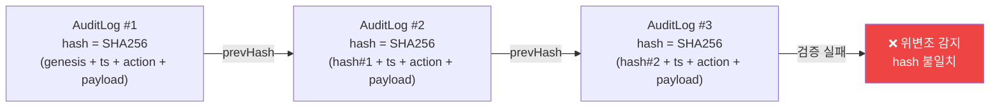

# ConsentLedger

> **개인정보 전송요구권(마이데이터) 관리 시스템** — SHA-256 해시 체인 감사 로그 + AI 이상 탐지 + MCP 서버 통합

<p align="center">
  
  
  
  
  
  
</p>

<p align="center">
  <a href="https://github.com/teriyakki-jin/ConsentLedger/actions/workflows/ci.yml">
    
  </a>
  
  
</p>

<p align="center">
  <strong>🌐 Live Demo: <a href="https://dgrf2fg1y3qje.cloudfront.net">https://dgrf2fg1y3qje.cloudfront.net</a></strong>
</p>

---

## 목차

- [프로젝트 소개](#프로젝트-소개)
- [핵심 기능](#핵심-기능)
- [기술 스택](#기술-스택)
- [시스템 아키텍처](#시스템-아키텍처)
- [AWS 인프라](#aws-인프라)
- [CI/CD 파이프라인](#cicd-파이프라인)
- [데이터 모델](#데이터-모델)
- [Quick Start (로컬)](#quick-start-로컬)
- [API Reference](#api-reference)
- [MCP 서버 연동](#mcp-서버-연동)
- [테스트](#테스트)
- [환경변수](#환경변수)

---

## 프로젝트 소개

**ConsentLedger**는 「개인정보 보호법」 제35조의2에 기반한 **개인정보 전송요구권(마이데이터)** 흐름을 구현한 풀스택 참조 시스템입니다.

단순한 CRUD를 넘어 **보안 설계**, **감사 추적**, **AI 통합**을 실제 운영 환경에서 검증할 수 있도록 설계했습니다.

### 왜 만들었나

| 문제 | ConsentLedger의 접근 |
|------|---------------------|
| 감사 로그 위변조 탐지 불가 | SHA-256 **해시 체인**으로 전체 이력 무결성 보장 |
| 보안 위협 수동 분석의 한계 | **Claude Sonnet AI**가 로그 패턴 자동 분석 |
| AI 도구와 시스템 통합 복잡성 | **Spring AI MCP 서버**로 Claude Desktop 직접 연결 |
| JWT만으로 부족한 Agent 인증 | **이중 인증** (JWT + SHA-256 API Key) 구조 |

---

## 핵심 기능

### 🔐 이중 인증 체계
- **사용자**: JWT Bearer 토큰 (15분 만료)
- **Agent**: `X-API-Key` 헤더 (SHA-256 해시로 DB 저장, 평문 미보관)
- **RBAC**: `USER` / `ADMIN` / `AGENT` 역할 기반 접근 제어

### 🔗 SHA-256 해시 체인 감사 로그
```
[LogN] hash = SHA-256(prevHash + timestamp + action + payloadJson)
[LogN+1] hash = SHA-256(hash_of_LogN + ...)
```
- DB 트리거로 **UPDATE/DELETE 원천 차단** (`audit_logs_immutable`)
- `GET /admin/audit-logs/verify` 로 전체 체인 무결성 검증
- 비관적 잠금으로 동시 삽입 시 해시 체인 직렬화 보장

### 🤖 AI 이상 탐지
Claude Sonnet이 감사 로그를 분석해 4가지 패턴 자동 탐지:

| 패턴 | 설명 |
|------|------|
| `ACCOUNT_TAKEOVER` | 비정상 로그인 시도 패턴 |
| `DATA_EXFILTRATION` | 대량 데이터 접근 |
| `PRIVILEGE_ABUSE` | 권한 남용 |
| `ABNORMAL_HOURS` | 비업무 시간대 접근 |

### 🛠 Spring AI MCP 서버
Claude Desktop 등 MCP 클라이언트와 SSE로 직접 연결. 6개 도구 등록:
`getAuditLogs` · `verifyAuditChain` · `getConsentsByUser` · `getTransferRequests` · `listUsers` · `analyzeAnomalies`

### 📊 전송 요청 상태 머신
```
PENDING → APPROVED → EXECUTING → COMPLETED
                  ↘             ↘
               REJECTED        FAILED
```
- 멱등성 보장 (`REQUIRES_NEW` 트랜잭션)
- 비관적 잠금으로 동시 승인/실행 충돌 방지

---

## 기술 스택

| 영역 | 기술 | 선택 이유 |
|------|------|----------|
| **Backend** | Java 17, Spring Boot 3.3.5 | LTS, Virtual Thread 지원 |
| **Security** | Spring Security, JJWT, BCrypt | 산업 표준 |
| **AI / MCP** | Spring AI 1.0.0, Claude Sonnet (Anthropic) | 최신 AI 통합 표준 |
| **Database** | PostgreSQL 16, Spring Data JPA, Flyway | JSONB, 강력한 트랜잭션 |
| **Frontend** | React 19, TypeScript, Vite, TailwindCSS | 최신 React 기능 |
| **Infra** | Docker, nginx, GitHub Actions | 컨테이너 기반 배포 |
| **Cloud** | AWS EC2, RDS, S3, CloudFront | 실제 운영 환경 구성 |
| **Testing** | JUnit 5, Mockito, Testcontainers | 80%+ 커버리지 |
| **Docs** | springdoc-openapi (Swagger UI) | API 문서 자동화 |

---

## 시스템 아키텍처



### 인증 흐름



### 해시 체인 무결성 구조



> DB 트리거(`audit_logs_immutable`)로 UPDATE/DELETE 원천 차단. `GET /admin/audit-logs/verify`로 전체 체인 일괄 검증.

### 패키지 구조

```
src/main/java/com/consentledger/
├── domain/
│   ├── auth/           # JWT 발급/검증
│   ├── user/           # 사용자 관리
│   ├── agent/          # API Key 인증 Agent
│   ├── dataholder/     # 데이터 보유자
│   ├── consent/        # 동의 생성/철회
│   ├── transfer/       # 전송 요청 상태 머신
│   └── audit/
│       ├── anomaly/    # AI 이상 탐지 (Claude Sonnet)
│       ├── demo/       # 데모 시나리오 생성기
│       └── tamper/     # 해시 체인 위변조 시뮬레이터
├── mcp/
│   ├── McpServerConfig.java
│   └── tools/          # @Tool 어노테이션 MCP 도구 6종
└── global/
    ├── config/         # Security, JPA, CORS, PDF
    ├── security/       # JWT Filter, API Key Filter
    ├── exception/      # Global Exception Handler
    └── util/           # HashChain, AuditLogger
```

---

## AWS 인프라

### 배포 아키텍처

```
사용자 (HTTPS)
     │
     ▼
┌─────────────────────────────┐
│   CloudFront (HTTPS → HTTP) │  캐싱, SSL 종료
└────────────┬────────────────┘
             │
     ┌───────▼────────┐
     │   S3 Bucket    │  React 정적 빌드 (index.html 캐시 없음)
     └────────────────┘

   API 요청 (백엔드 직접 호출: http://EC2-IP)
             │
     ┌───────▼─────────────────────────────┐
     │   EC2 (eu-north-1, t3.micro)         │
     │   ┌─────────────────────────────┐   │
     │   │  nginx :80                   │   │
     │   │  ↓ proxy_pass               │   │
     │   │  Spring Boot :8080 (Docker)  │   │
     │   └─────────────────────────────┘   │
     └───────────────────┬─────────────────┘
                         │ 5432 (VPC 내부)
               ┌─────────▼──────────┐
               │  RDS PostgreSQL 16  │
               │  (db.t4g.micro)     │
               └────────────────────┘
```

### AWS 리소스 현황

| 리소스 | 스펙 | 리전 |
|--------|------|------|
| EC2 | t3.micro, Amazon Linux 2023 | eu-north-1 |
| RDS | PostgreSQL 16, db.t4g.micro | eu-north-1 |
| S3 | consentledger-frontend | eu-north-1 |
| CloudFront | E16PKAHHTR1AYQ | Global |

### EC2 초기 설정

```bash
# Amazon Linux 2023 기준
sudo yum install -y docker git
sudo systemctl enable --now docker

git clone https://github.com/teriyakki-jin/ConsentLedger.git /opt/consentledger
cd /opt/consentledger

# 환경변수 설정
cp .env.example .env && vi .env

# ghcr.io 로그인
echo "<GITHUB_PAT>" | sudo docker login ghcr.io -u <USERNAME> --password-stdin

# RDS 연결 모드로 실행
sudo docker compose -f docker-compose.rds.yml up -d
```

---

## CI/CD 파이프라인

`main` 브랜치 push 시 자동 실행:

```
push to main
    │
    ▼
╔══════╗
║ test ║  단위 테스트 (119개) + 통합 테스트 (26개, Testcontainers)
╚══╤═══╝
   │ 성공 시
   ├──────────────────────────────────▶ ╔══════════════════╗
   │                                    ║ deploy-frontend  ║
   │                                    ║ Vite 빌드        ║
   │                                    ║ → S3 sync        ║
   │                                    ║ → CF Invalidate  ║
   ▼                                    ╚══════════════════╝
╔═════════╗
║ publish ║  Docker 빌드 → ghcr.io 푸시 (sha + latest 태그)
╚════╤════╝
     │
     ▼
╔══════════════════╗
║ deploy-backend   ║  SSH → EC2 → docker compose pull → up
╚══════════════════╝
```

| Secret | 설명 | 미설정 시 |
|--------|------|----------|
| `DEPLOY_HOST` | EC2 IP | deploy-backend skip |
| `DEPLOY_USER` | SSH 사용자 | deploy-backend skip |
| `DEPLOY_KEY` | SSH 개인키 (raw PEM) | deploy-backend skip |
| `AWS_ACCESS_KEY_ID` | IAM 키 | deploy-frontend skip |
| `AWS_SECRET_ACCESS_KEY` | IAM 시크릿 | deploy-frontend skip |
| `AWS_REGION` | 리전 | deploy-frontend skip |
| `S3_BUCKET_NAME` | S3 버킷명 | deploy-frontend skip |
| `CLOUDFRONT_DISTRIBUTION_ID` | CF 배포 ID | CF invalidation skip |
| `VITE_API_BASE_URL` | 백엔드 API URL | 빌드 시 환경변수 미주입 |

> **Secrets 미설정 = 해당 Job 자동 skip** — 로컬/VPS 환경에서도 CI가 정상 동작합니다.

---

## 데이터 모델

```
users ──────────────────────────────┐
  │ 1:N                             │
consents ◀── transfer_requests ─────┤
  │                                 │
  └── audit_logs (immutable) ───────┘
        │ SHA-256 hash chain
        ▼
  audit_chain_anchor (lock row)
```

### 감사 로그 해시 체인 상세

```sql
-- 무결성 보장: 트리거로 UPDATE/DELETE 차단
CREATE TRIGGER audit_logs_immutable
  BEFORE UPDATE OR DELETE ON audit_logs
  EXECUTE FUNCTION prevent_audit_modification();

-- 해시 계산 (Java)
String raw = prevHash + timestamp.truncatedTo(MICROS) + action + payloadJson;
String hash = sha256Hex(raw);
```

---

## Quick Start (로컬)

### 1. DB 실행

```bash
docker compose up -d
```

| 서비스 | URL | 비고 |
|--------|-----|------|
| PostgreSQL | `localhost:5432` | Flyway 자동 마이그레이션 |
| pgAdmin | `http://localhost:5050` | `admin@consentledger.com` / `admin` |

### 2. Backend 실행

```bash
./gradlew bootRun
# Windows: gradlew.bat bootRun
```

| 서비스 | URL |
|--------|-----|
| API Server | `http://localhost:8080` |
| Swagger UI | `http://localhost:8080/swagger-ui` |
| MCP SSE | `http://localhost:8080/sse` (ADMIN JWT 필요) |

### 3. Frontend 실행

```bash
cd frontend
npm install && npm run dev
# http://localhost:5173
```

### 테스트 계정

| 역할 | 이메일 | 비밀번호 |
|------|--------|----------|
| ADMIN | `admin@consentledger.com` | `admin1234` |
| USER | `user@consentledger.com` | `user1234` |
| AGENT | `X-API-Key: test-api-key-agent-a` | — |

> 동일한 계정으로 [Live Demo](https://dgrf2fg1y3qje.cloudfront.net)에도 로그인 가능합니다.

---

## API Reference

### Auth
| Method | Path | 설명 |
|--------|------|------|
| POST | `/auth/login` | JWT 발급 |

### Consents
| Method | Path | 권한 | 설명 |
|--------|------|------|------|
| POST | `/consents` | USER | 동의 생성 |
| GET | `/consents` | USER | 내 동의 목록 |
| POST | `/consents/{id}/revoke` | USER | 동의 철회 |

### Transfer Requests
| Method | Path | 권한 | 설명 |
|--------|------|------|------|
| POST | `/transfer-requests` | USER·AGENT | 전송 요청 생성 |
| POST | `/transfer-requests/{id}/approve` | USER | 승인 |
| POST | `/transfer-requests/{id}/execute` | AGENT | 실행 |

### Admin
| Method | Path | 설명 |
|--------|------|------|
| GET | `/admin/audit-logs` | 감사 로그 조회 (필터링) |
| GET | `/admin/audit-logs/verify` | 해시 체인 무결성 검증 |
| GET | `/admin/audit-logs/analyze?days=7` | AI 이상 탐지 분석 |
| GET | `/admin/reports/audit` | PDF 리포트 다운로드 |
| GET | `/admin/users` | 사용자 목록 |
| GET/PATCH | `/admin/agents/{id}/status` | Agent 관리 |

### Demo (ADMIN)
| Method | Path | 설명 |
|--------|------|------|
| POST | `/admin/demo/anomaly-scenario` | 43개 이상 패턴 로그 생성 |
| POST | `/admin/demo/tamper/{logId}` | 해시 체인 위변조 시뮬레이션 |
| GET | `/admin/demo/tamper/status` | 체인 검증 결과 조회 |

> 전체 API 문서: `http://localhost:8080/swagger-ui`

---

## MCP 서버 연동

Claude Desktop `claude_desktop_config.json`:

```json
{
  "mcpServers": {
    "consentledger": {
      "transport": "sse",
      "url": "http://localhost:8080/sse",
      "headers": {
        "Authorization": "Bearer <ADMIN_JWT_TOKEN>"
      }
    }
  }
}
```

**사용 예시:**
> "지난 7일간 감사 로그에서 이상 징후를 분석해줘"
> → Claude가 `analyzeAnomalies` 도구를 호출해 AI 분석 결과 반환

---

## 테스트

```bash
# 단위 테스트 (Mockito, @WebMvcTest)
./gradlew test

# 통합 테스트 (Testcontainers PostgreSQL, Docker 필요)
./gradlew test -Dintegration.tests.enabled=true
```

| 구분 | 수량 | 대상 |
|------|------|------|
| 단위 테스트 | 119개 | Service, Controller, MCP Tools, Anomaly |
| 통합 테스트 | 26개 | API 엔드포인트 E2E (실제 DB) |
| **합계** | **145개** | |

### 테스트 설계 원칙
- Fixture 클래스로 테스트 데이터 중앙 관리 (`UserFixture`, `AuditLogFixture` 등)
- Security Context는 `SecurityContextHolder` 직접 설정 (단위 테스트 독립성)
- `@PersistenceContext` 필드는 `ReflectionTestUtils.setField`로 주입

---

## 환경변수

| 변수 | 기본값 | 설명 |
|------|--------|------|
| `JWT_SECRET` | — | **필수** JWT 서명키 (`openssl rand -hex 32`) |
| `DB_HOST` | `localhost` | PostgreSQL 호스트 |
| `DB_PORT` | `5432` | PostgreSQL 포트 |
| `DB_NAME` | `consentledger` | DB명 |
| `DB_USERNAME` | `consentledger` | DB 사용자 |
| `DB_PASSWORD` | `consentledger_pw` | DB 비밀번호 |
| `SPRING_PROFILES_ACTIVE` | `local` | `prod` 설정 시 파일 로그, JSON 포맷 |
| `CORS_ALLOWED_ORIGINS` | `localhost:*` | CORS 허용 origin (콤마 구분) |
| `OPENAI_API_KEY` | — | AI 이상탐지용 (미설정 시 graceful degradation) |

---

## License

MIT © 2025 teriyakki-jin
